# ReventX/Splash25 - C4 Architecture Documentation

## Overview

This document describes the architecture of the ReventX (Splash25) Event Management System using the C4 model approach - Context, Containers, Components, and Code.

---

## Level 1: System Context Diagram

### Purpose
Shows the big picture - how the Splash25 system fits into the world around it, including users and external systems.

### System Context

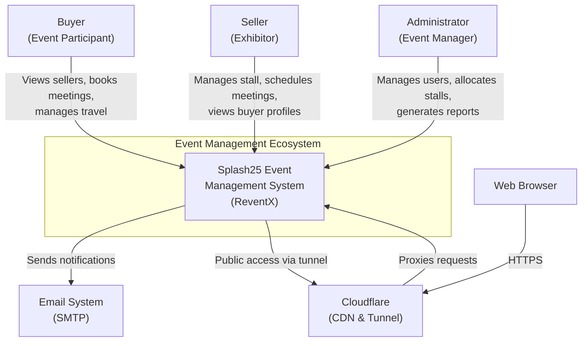

### Key Users & Systems

**Primary Users:**
- **Buyers (626):** Event participants looking to connect with sellers
  - Browse seller profiles and stalls
  - Schedule meetings based on availability
  - Manage travel plans and accommodations
  - View floor plans and navigate event venue

- **Sellers (156):** Exhibitors showcasing products/services
  - Manage stall information and profile
  - Schedule meeting time slots
  - View and approve meeting requests
  - Track attendees and check-ins

- **Administrators:** Event management team
  - User management and approval
  - Stall allocation and floor plan management
  - Meeting oversight and conflict resolution
  - Generate reports and analytics

**External Systems:**
- **Email System:** Notification and communication delivery
- **Cloudflare:** CDN, security, and global access via tunnel
- **Web Browsers:** User interface access point

---

## Level 2: Container Diagram

### Purpose
Shows the high-level shape of the software architecture and the responsibilities of, and interactions between, containers (applications, data stores, etc.).

### Container Architecture

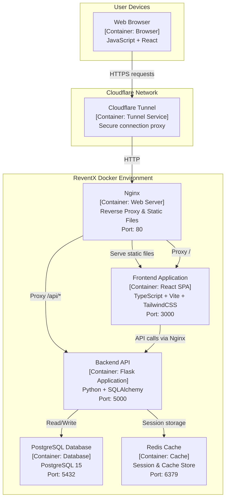

### Container Details

#### 1. **Nginx Web Server**
- **Technology:** Nginx 1.29.3
- **Purpose:** Reverse proxy and static file server
- **Responsibilities:**
  - Route API requests to backend (path: `/api/*`)
  - Serve frontend static files
  - Handle CORS and security headers
  - SSL termination (when enabled)
- **Port:** 80 (HTTP)

#### 2. **Frontend Application**
- **Technology:** React 18 + TypeScript + Vite
- **UI Framework:** TailwindCSS + shadcn/ui
- **Purpose:** Single Page Application providing user interface
- **Key Features:**
  - Buyer dashboard and seller profiles
  - Meeting scheduling interface
  - Travel plan management
  - Floor plan visualization
  - Admin management console
- **Port:** 3000 (Development server)

#### 3. **Backend API**
- **Technology:** Python Flask + SQLAlchemy
- **Purpose:** RESTful API server
- **Responsibilities:**
  - Business logic execution
  - Authentication and authorization
  - Database operations via ORM
  - Meeting scheduling algorithms
  - Distance matrix calculations
  - File upload handling
- **Port:** 5000

#### 4. **PostgreSQL Database**
- **Technology:** PostgreSQL 15
- **Purpose:** Primary data store
- **Data:**
  - User profiles (783 users)
  - Meeting schedules (13,602 meetings)
  - Travel plans (524 plans)
  - Stall inventory (5,148 items)
  - Time slots (19,740 slots)
- **Port:** 5432

#### 5. **Redis Cache**
- **Technology:** Redis 7
- **Purpose:** Session store and cache
- **Responsibilities:**
  - User session management
  - Temporary data caching
  - Rate limiting data
- **Port:** 6379

#### 6. **Cloudflare Tunnel**
- **Technology:** cloudflared
- **Purpose:** Secure public access without exposing ports
- **Features:**
  - Zero-trust network access
  - Automatic SSL/TLS
  - Global CDN integration
  - DDoS protection

---

## Level 3: Component Diagram

### Purpose
Decompose each container into components, showing their responsibilities and technology/implementation details.

### Backend API Components

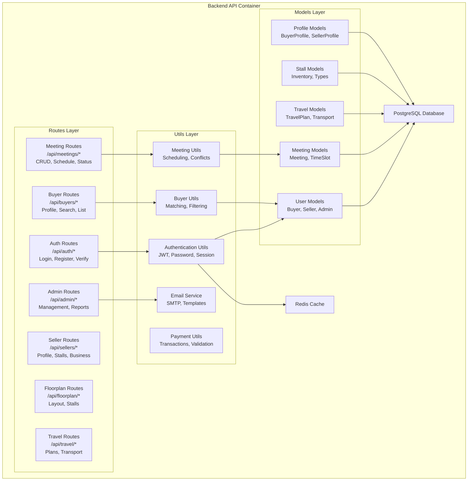

### Frontend Application Components

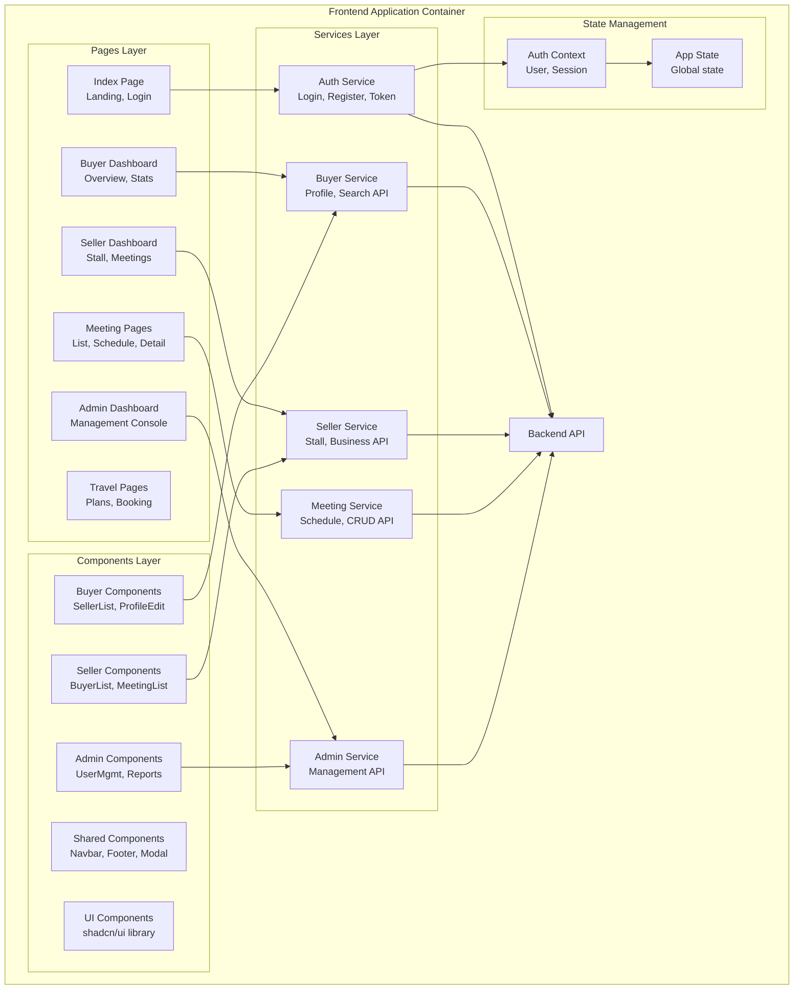

### Component Descriptions

#### Backend Components

**1. Routes Layer (API Endpoints)**
- `auth.py`: Authentication endpoints (login, register, verify)
- `buyers.py`: Buyer-specific endpoints
- `seller.py`: Seller-specific endpoints
- `meeting.py`: Meeting management endpoints
- `admin.py`: Administrative endpoints
- `floorplan.py`: Floor plan and stall endpoints
- `system.py`: System settings and health checks

**2. Utils Layer (Business Logic)**
- `auth.py`: JWT token management, password hashing
- `email_service.py`: Email notifications and templates
- `meeting_utils.py`: Meeting scheduling algorithms
- `buyer_utils.py`: Buyer matching and filtering
- `payment_utils.py`: Payment processing helpers

**3. Models Layer (Data Access)**
- User-related: User, BuyerProfile, SellerProfile
- Meeting-related: Meeting, TimeSlot, MeetingMetadata
- Travel-related: TravelPlan, Transportation, Accommodation
- Stall-related: StallInventory, StallType, StallDistanceMatrix
- Reference: BuyerCategory, Interest, PropertyType

#### Frontend Components

**1. Pages Layer**
- Landing and authentication pages
- Role-specific dashboards (buyer/seller/admin)
- Feature-specific pages (meetings, travel, reports)

**2. Components Layer**
- Role-specific components (buyer/seller/admin)
- Shared UI components (navbar, footer, modals)
- shadcn/ui component library integration

**3. Services Layer**
- API client wrappers for backend communication
- Request/response transformation
- Error handling and retry logic

**4. State Management**
- AuthContext: User authentication state
- Global state management for app-wide data

---

## Level 4: Code Diagram

### Purpose
Show how key components are implemented in code (class diagrams, sequence diagrams).

### Meeting Scheduling Sequence

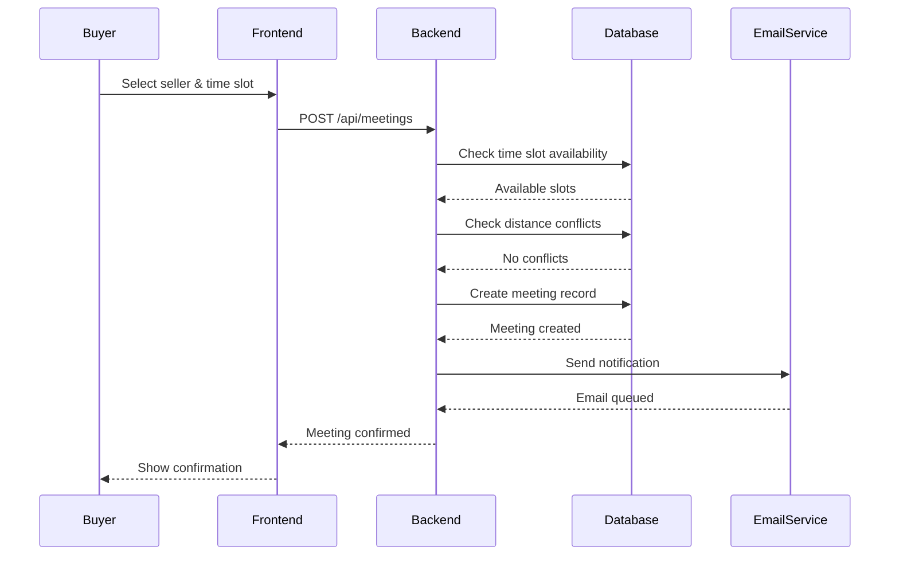

### Authentication Flow

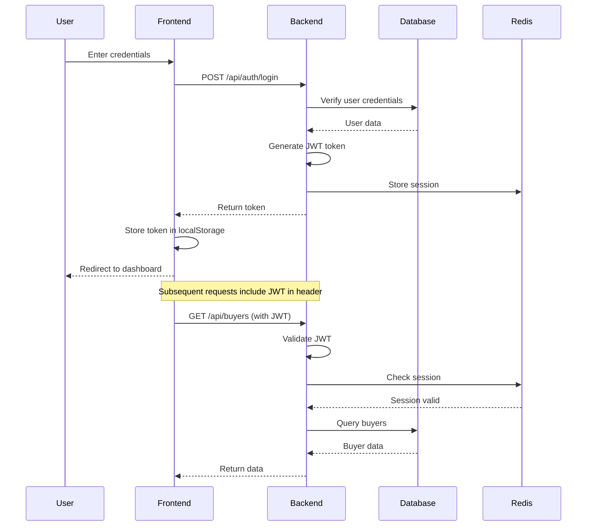

### Database Schema - Core Entities

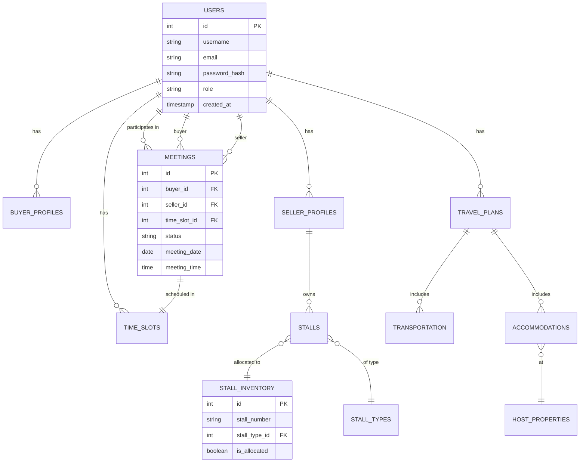

---

## Deployment Architecture

### Container Orchestration

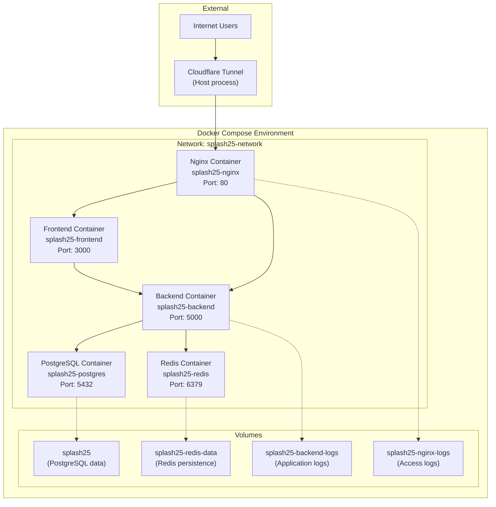

### Health Check Flow

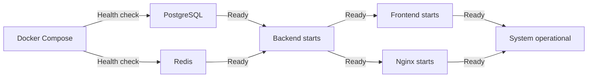

---

## Data Flow Diagrams

### Meeting Creation Data Flow

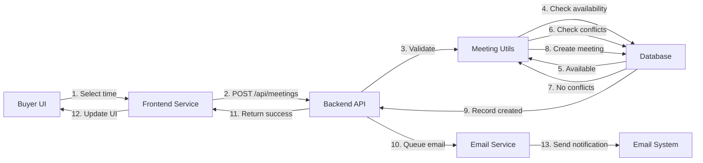

### User Authentication Data Flow

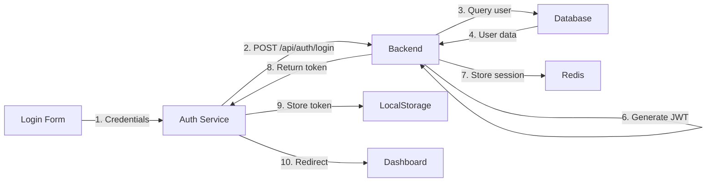

---

## Technology Stack Summary

### Frontend Stack
```
React 18.3.1
├── TypeScript 5.5.3
├── Vite 5.4.1 (Build tool)
├── TailwindCSS 3.4.1 (Styling)
├── shadcn/ui (Component library)
├── Tanstack Query (Data fetching)
└── React Router (Navigation)
```

### Backend Stack
```
Python 3.11
├── Flask 3.0.3 (Web framework)
├── SQLAlchemy 2.0.30 (ORM)
├── Flask-CORS (CORS handling)
├── PyJWT (Authentication)
└── Redis-py (Cache client)
```

### Infrastructure Stack
```
Docker Compose
├── PostgreSQL 15 (Database)
├── Redis 7 (Cache)
├── Nginx 1.29.3 (Web server)
└── Cloudflared (Tunnel)
```

---

## Security Architecture

### Security Layers

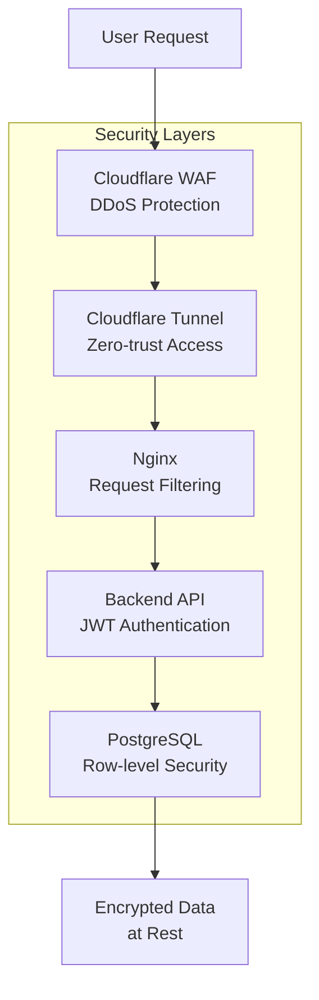

### Authentication Flow
1. **Password Storage:** Bcrypt hashing with salt
2. **Session Management:** JWT tokens with expiry
3. **API Security:** Token validation on every request
4. **Database Access:** Connection pooling with credentials
5. **Cache Security:** Redis password protection

---

## Scalability Considerations

### Current Architecture Capacity
- **Users:** 783 (626 buyers + 156 sellers)
- **Concurrent Meetings:** 13,602 scheduled
- **Database Size:** ~500MB with staging data
- **Response Time:** <200ms average

### Horizontal Scaling Strategy
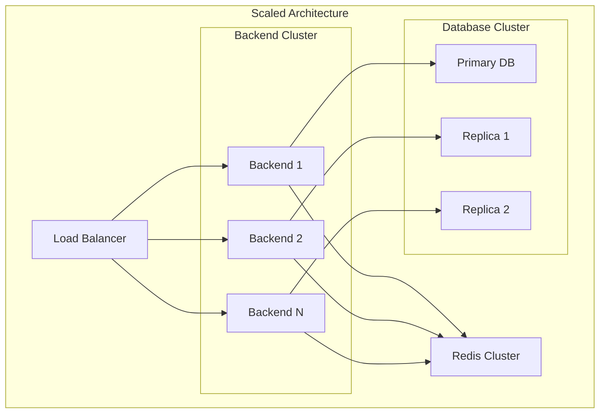

---

## Monitoring & Observability

### Key Metrics
- **Application Metrics:**
  - Request rate and latency
  - Error rates by endpoint
  - Active user sessions
  - Meeting creation rate

- **Infrastructure Metrics:**
  - Database connection pool utilization
  - Redis cache hit rate
  - Docker container resource usage
  - Disk space utilization

- **Business Metrics:**
  - Daily active users
  - Meeting completion rate
  - Travel plan submissions
  - Stall allocation status

---

## Future Architecture Evolution

### Planned Enhancements
1. **Microservices Migration**
   - Split meeting, travel, and user services
   - Event-driven architecture with message queue

2. **Enhanced Caching**
   - CDN for static assets
   - Redis cluster for session store
   - Application-level caching

3. **Real-time Features**
   - WebSocket support for live updates
   - Push notifications
   - Real-time chat between users

4. **Analytics Platform**
   - Data warehouse for reporting
   - Business intelligence dashboards
   - Predictive analytics for meeting optimization

---

## Glossary

- **Buyer:** Event participant looking to schedule meetings with sellers
- **Seller:** Exhibitor with a stall at the event
- **Stall:** Physical booth space allocated to sellers
- **Meeting:** Scheduled appointment between buyer and seller
- **Time Slot:** Available time period for meetings
- **Travel Plan:** Buyer's travel arrangements including transport and accommodation
- **Floor Plan:** Layout of exhibition hall with stall locations
- **Distance Matrix:** Pre-calculated distances between stalls for optimization

---

## References

- [C4 Model](https://c4model.com/)
- [Docker Compose Documentation](https://docs.docker.com/compose/)
- [React Documentation](https://react.dev/)
- [Flask Documentation](https://flask.palletsprojects.com/)
- [PostgreSQL Documentation](https://www.postgresql.org/docs/)
- [Cloudflare Tunnel Documentation](https://developers.cloudflare.com/cloudflare-one/connections/connect-apps/)

---

**Document Version:** 1.0  
**Last Updated:** November 9, 2025  
**Maintained By:** Development Team
